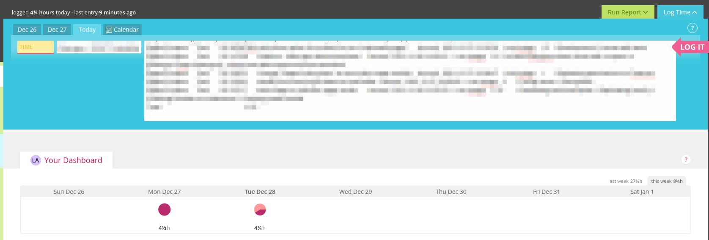

# csv-to-nokotime - Experimental

## Paste Jira exported CSV into Nokotime
Imports time into Nokotime from a Jira exported CSV, assuming all the logged time is for the same client.

### Instructions
- Export a group of hours from one client in the Jira timesheet.
- Open your CSV file with LibreOffice.
- Copy everything. See `data-example.txt` on this repo.
- Visit Nokotime and login.
- Open the console and run `main.js`.
- Paste everything in the task description.
- Ensure time is empty.
- Select the client for the hours to be logged in bulk.
- Click `LOG IT`.

### Issues
If for any reason, logging stops, just click "LOG IT" again. If that doesn't work... \o/